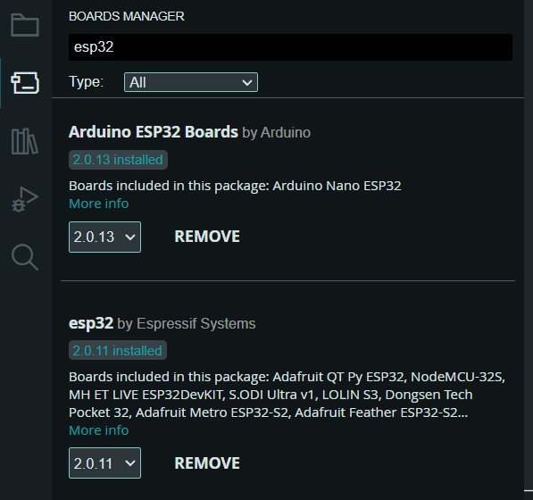
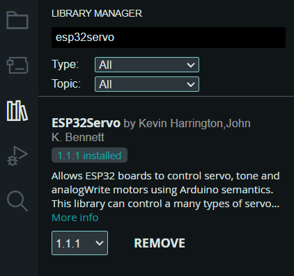

# wine-pourer-esp32

## 安裝

1. 下載 [Arduino IDE 2.0](https://docs.arduino.cc/software/ide-v2)
2. 下載此 [repository](https://docs.arduino.cc/software/ide-v2)：在任意資料夾目錄中，開啟 Git Bash 並輸入以下指令。
   ```powershell=
   git clone https://github.com/pomelo925/wine-pourer-esp32.git
   ```

3. 開啟 Arduino IDE 2.0，點選「檔案」->「開啟...」-> `main.ino`  ( 帶有Arduion圖案 )。
4. 至左側「BOARDS MANAGER」下載「Arduino ESP32 Boards」、「esp32」、「ESP32Servo」。

  <p align="center">
    
    
  </p>

5. 選擇開發版「WEMOS D1 R32」。
6. 在上方「工具」欄位中，選擇適當之「連接阜」。
7. 點擊「打勾」符號為驗證，即編譯。
8. 點擊「箭頭」符號為上傳，上傳完畢後程式即開始運作。
9. 若須開啟Arduino終端機，在上方「工具」欄位中選擇「序列阜監控窗」。
